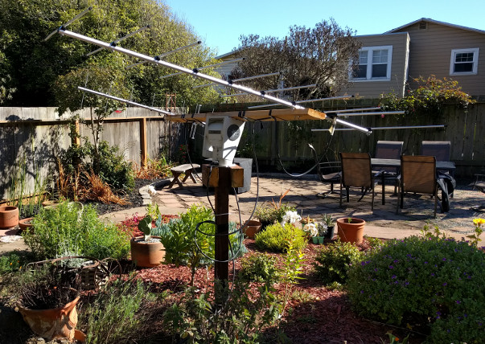

# Pan/Tilt Az/El Controller Firmware

This firmware is used to control a Pan/Tilt base with synchronous motor
(of the sort used to steer security cameras) for the purpose of satellite
antenna steering. This firmware resides on an Atmel microcontroller used to
control relays that drive the motors in the Pan/Tilt base, and has been
used successfully in a system consisting of the following components:

* KMTronic USB Four Channel Relay Controller
  (http://www.kmtronic.com/usb-four-channel-relay-controller-pcb.html)
* Vicon V330APT Pan/Tilt base
* Home-built 24VAC power supply



The controller firmware emulates a Yaesu GS-232 rotor controller on its serial
port and has been used successfully with the following control software:

* SatPC32 12.8c (via ServerSDX)
* Ham Radio Deluxe 5.24.0.38 (via HRD Rotator)

The KMTronic board was selected for the following reasons:

* Has an onboard Atmel microcontroller
* Has a USB/Serial converter already on-board (connected to UART in the uC)
* Available relatively inexpensively on eBay
* Has a properly designed PCB (power and ground planes, and decoupling caps)
  so that the uC operation is not disturbed by inductive kickback on the relays
  (unlike the first one I tried to use, from http://www.whelectronics.pl)

Any relay board w/ an Atmel uC can be targeted, however.

The controller relies on the hardware limit switches in the pan/tilt base
being set at 0 degrees azimuth and 90 degrees elevation. Upon startup, it
drives the pan/tilt base to the stops to acquire initial position. From
that point on, it relies on timer-based dead reckoning to control the
pan/tilt position. This is a fairly accurate method with the synchronous
motors in the V330APT, as they drive at a constant speed based on the 60Hz
rate of the AC power supply.

The rotor.h file contains constants to set soft limits of the positioner
(e.g. at one point I set the minimum elevation to 10 degrees, to avoid smacking
the antennas into my roof). It also allows control over the hysteresis in the
position control loop. The control loop tries to avoid turning on the motors
unless they will be on for a decent duration (e.g. at least a few seconds) to
avoid error accumulation from motor startup/shutdown effects. The control loop
will not reposition the antenna unless the difference between the current and
requested position is above a certain threshold (by default, 2 seconds of
rotation).

The supplied Makefile will build and program the firmware into a target device.
It has been used in an Ubuntu Linux environment, with the following packages
installed:

```
$ dpkg --get-selections | grep avr
avr-libc					install
avrdude						install
binutils-avr					install
gcc-avr						install
```
If you end up using this code, I'd be curious to hear about your experiences!

73 de Ben Gelb, N1VF
